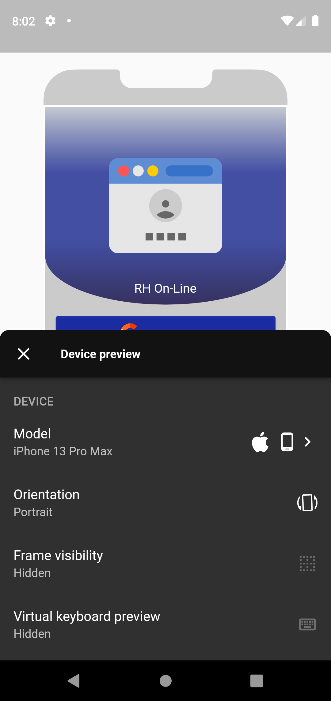
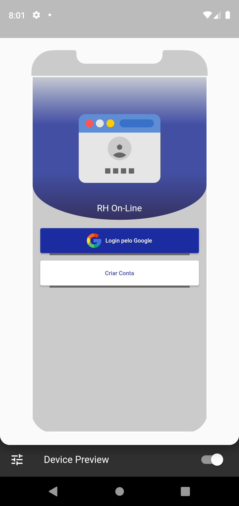
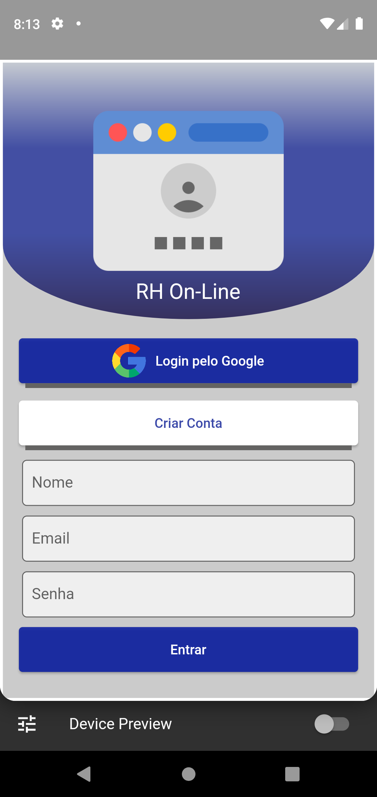
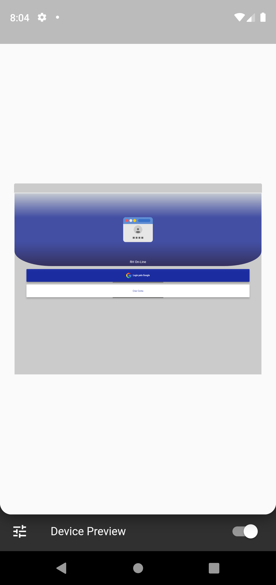

# login-responsivo
<h1 align="center">Login-Responsivo: </h1>
<h1 align="center">
  </h1>

</h4>
 <a href="#Descrição">Descrição</a> •
 <a href="#Experiencia">Experiencia</a> •
 <a href="#Features">Features</a> •
 <a href="#Rodar">Rodar</a> • 
 <a href="#Telas">Telas</a> •
 <a href="#Referencias">Referências</a> •  

## Descrição

Um App feito para testes de responsividade...
 

## Experiencia
Achei muito interessante e fácil utilizar "LayoutBuilder" com constraints para conrolar a responsividade da tela em varios formatos e resoluções, e neste contexto o plugin "Device Preview" já agiliza os testes nestes contextos diversos.</a>
### Features
- [x] 1 - Tela de Login
- [x] 2 - Utilização de BorderRadius.ellipitical
- [x] 3 - Botão Interativo
- [x] 4 - Uso de Stack para sobreposição das camadas

### Rodar
- [x] Fazer Clone do Projeto: git clone https://github.com/willgoncalvescruz/login-responsivo.git
- [x] Acessar diretório: cd super_app
- [x] Baixar dependencias: flutter pub get

### Telas
<h1 align="center">

  
  
  
</h1>